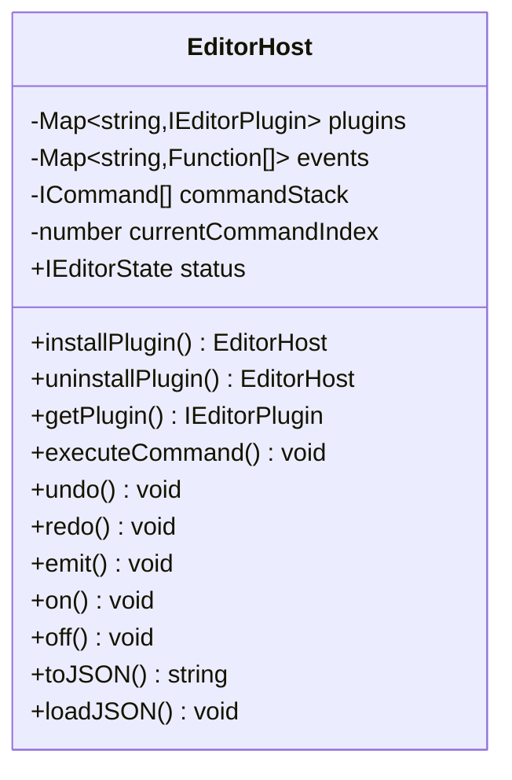
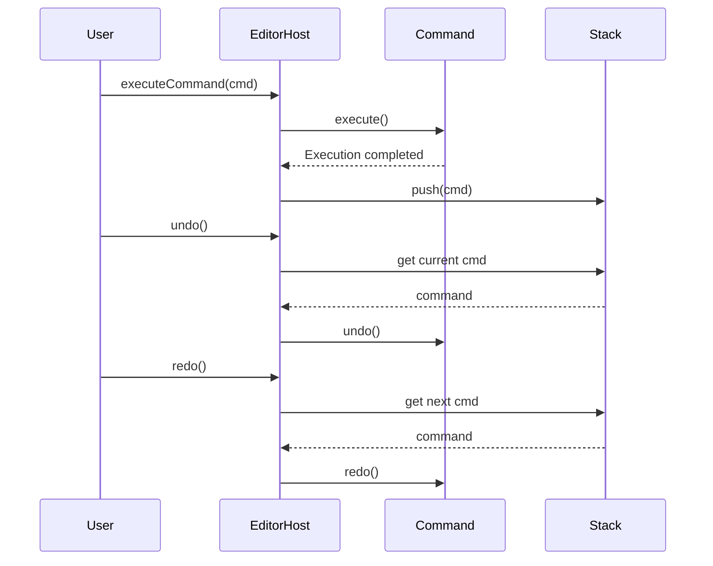
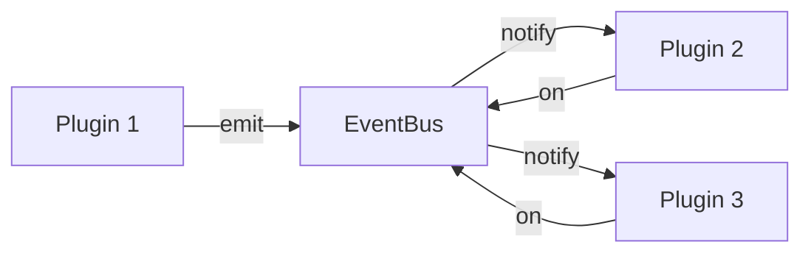
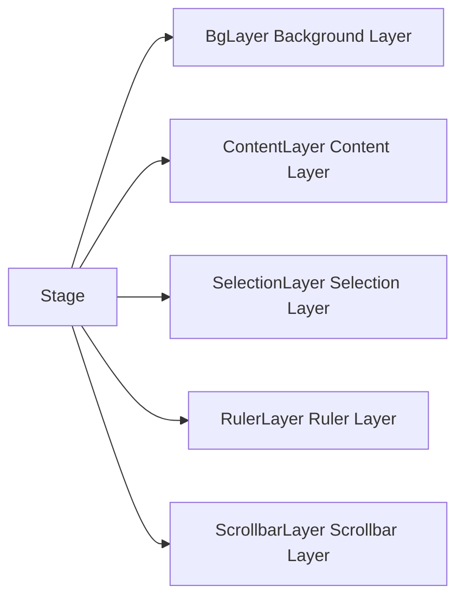

# vkedit

<div align="center">

[](https://www.npmjs.com/package/vkedit)
[](LICENSE)
[](package.json)

**Vue3 Konva Plug-in designer**

A powerful, extensible graphic editor plugin library built on Vue 3 and Konva.js. Suitable for label template design, QR code design, barcode design, ticket design, business card design, certificate design, and more.

**[🇨🇳 中文版](README.md)**

</div>

<div align="center">


</div>

---


## 🚀 Installation and Usage

### Environment Requirements

- **Node.js**: ^20.19.0 || >=22.12.0
- **Package Manager**: pnpm 10.19.0+

### Installation

```bash
# Using npm
npm install vkedit vue konva vue-konva pinia

# Using pnpm
pnpm add vkedit vue konva vue-konva pinia

# Using yarn
yarn add vkedit vue konva vue-konva pinia
```

### Entry File Example (main.ts)

In the project entry file `main.ts`, you need to properly configure the Vue application, Pinia state management, and VueKonva:

```typescript
import { createApp } from 'vue'
import { createPinia } from 'pinia'
import App from './App.vue'
import VueKonva from 'vue-konva'
import 'vkedit/dist/vkedit.css' // Import vkedit styles

const app = createApp(App)

app.use(createPinia())
app.use(VueKonva)
app.mount('#app')
```

### Basic Usage Example

```vue
<template>
  <Vkedit
    :host="host"
    :show-toolbox="true"
    :show-property-panel="true"
    :show-toolbar="true"
  />
</template>

<script setup lang="ts">
import { createEditorHost, Vkedit } from 'vkedit'
import { 
  RectPlugin, 
  TextPlugin, 
  TablePlugin,
  QrcodePlugin,
  BarcodePlugin,
  ChartPlugin,
  LinePlugin
} from 'vkedit'

// Create editor host
const host = createEditorHost({ 
  basePropertyPanel: false,
  baseCanvasPropertyPanel: true,
  exportPlugin: true,
  previewPlugin: true,
  importPlugin: true
})

// Install graphic plugins
host
  .installPlugin('rect-plugin', RectPlugin)
  .installPlugin('text-plugin', TextPlugin)
  .installPlugin('table-plugin', TablePlugin)
  .installPlugin('qr-plugin', QrcodePlugin)
  .installPlugin('barcode-plugin', BarcodePlugin)
  .installPlugin('chart-plugin', ChartPlugin)
  .installPlugin('line-plugin', LinePlugin)

// Set canvas dimensions (A4 paper)
host.setStatus({
  dpm: 8,          // Dots per millimeter (DPI / 25.4)
  width: 210 * 8,  // A4 width 210mm
  height: 297 * 8, // A4 height 297mm
  zoom: 0.4        // Zoom level
})
</script>
```

### Optional Configuration

The `createEditorHost` function accepts the following configuration options:

| Option                    | Type    | Default | Description                        |
| ------------------------- | ------- | ------- | ---------------------------------- |
| `basePropertyPanel`       | boolean | false   | Enable base element property panel |
| `baseCanvasPropertyPanel` | boolean | true    | Enable canvas property panel       |
| `exportPlugin`            | boolean | true    | Enable export plugin               |
| `previewPlugin`           | boolean | true    | Enable preview plugin              |
| `importPlugin`            | boolean | true    | Enable import plugin               |

---


## 📖 Project Overview

**vkedit** is a plugin-based graphic editor library built on Vue 3 and Konva.js. It provides a complete set of graphic editing features, including support for multiple graphic elements, a plugin system architecture, undo/redo mechanisms, and import/export functionality.

The project adopts a plugin-based architecture design, allowing developers to flexibly enable or disable various functional modules as needed, while supporting custom plugins and extension of graphic elements.

vkedit is particularly suitable for **label template design**, **QR code design**, **barcode design**, **ticket design**, **business card design**, **certificate design**, and various other graphic design scenarios, providing developers with powerful visual design capabilities.

- **Current Version**: 2.8.5
- **License**: MIT
- **Node.js Requirement**: ^20.19.0 || >=22.12.0

---

## ✨ Core Features

- **🔌 Plugin-based Architecture**: Flexible plugin system that enables or disables functional modules on demand
- **🎨 Multi-graphic Element Support**:
  - Rectangle
  - Text
  - Line
  - Table
  - QR Code
  - Barcode
  - Chart
- **📥📤 Import/Export**: Supports JSON format design data import and export
- **↩️↪️ Undo/Redo**: Complete history management based on command pattern
- **🏗️ Multi-layer Canvas System**: Supports background layer, content layer, selection layer, ruler layer, and scrollbar layer
- **🔍 Zoom and Ruler**: Precise canvas zooming and ruler display
- **📐 Alignment Tools**: Supports multiple alignment and distribution operations for elements
- **📋 Context Menu**: Right-click menu for quick operations
- **🎯 Event-driven**: Complete event system supporting inter-plugin communication
- **🏷️ Rich Application Scenarios**: Label template design, QR code design, barcode design, ticket design, business card design, certificate design, etc.

---

## 🎯 Application Scenarios

vkedit can be widely applied to the following scenarios:

| Application Scenario      | Suitable Features                            | Typical Usage                                                                 |
| ------------------------- | -------------------------------------------- | ----------------------------------------------------------------------------- |
| **Label Template Design** | QR codes, barcodes, text, rectangles, tables | Product labels, logistics labels, price tags, inventory labels                |
| **QR Code Design**        | QR code plugin, text, graphic elements       | Marketing QR codes, payment QR codes, information QR codes                    |
| **Barcode Design**        | Barcode plugin, text, graphic elements       | Product barcodes, book barcodes, inventory barcodes, logistics tracking codes |
| **Ticket Design**         | Tables, text, rectangles, lines              | Invoices, receipts, vouchers, reports                                         |
| **Business Card Design**  | Text, rectangles, image elements             | Personal cards, company cards, VIP cards                                      |
| **Certificate Design**    | Text, rectangles, tables, image elements     | Graduation certificates, honorary certificates, qualification certificates    |
| **Poster Design**         | Combination of multiple graphic elements     | Promotional posters, event posters, product posters                           |
| **Form Design**           | Tables, text, lines                          | Survey forms, application forms, registration forms                           |

### Typical Use Cases

#### 1. Label Template Design
```typescript
// Create label editor
const host = createEditorHost({
  exportPlugin: true,
  previewPlugin: true
})

// Install plugins required for label design
host
  .installPlugin('rect-plugin', RectPlugin)      // Borders, backgrounds
  .installPlugin('text-plugin', TextPlugin)      // Text information
  .installPlugin('qr-plugin', QrcodePlugin)      // Product QR code
  .installPlugin('barcode-plugin', BarcodePlugin)// Product barcode
  .installPlugin('table-plugin', TablePlugin)    // Table data

// Set label dimensions (standard label 100mm x 60mm)
host.setStatus({
  dpm: 8,
  width: 100 * 8,
  height: 60 * 8
})
```

#### 2. QR Code Design
```typescript
// Create QR code designer
const host = createEditorHost({
  exportPlugin: true
})

host
  .installPlugin('text-plugin', TextPlugin)      // Description text
  .installPlugin('qr-plugin', QrcodePlugin)      // QR code element
  .installPlugin('rect-plugin', RectPlugin)      // Decorative border

// Set canvas dimensions
host.setStatus({
  dpm: 8,
  width: 150 * 8,
  height: 150 * 8
})
```

#### 3. Barcode Design
```typescript
// Create barcode designer
const host = createEditorHost({
  exportPlugin: true,
  previewPlugin: true
})

host
  .installPlugin('barcode-plugin', BarcodePlugin)// Barcode
  .installPlugin('text-plugin', TextPlugin)      // Product information
  .installPlugin('line-plugin', LinePlugin)      // Divider line

// Set barcode label dimensions
host.setStatus({
  dpm: 8,
  width: 80 * 8,
  height: 50 * 8
})
```

---

## 🛠️ Tech Stack

### Core Framework and Libraries

| Dependency                                           | Version | Description                      |
| ---------------------------------------------------- | ------- | -------------------------------- |
| [Vue](https://vuejs.org/)                            | ^3.5.18 | Progressive JavaScript Framework |
| [Konva.js](https://konvajs.org/)                     | ^10.0.2 | 2D Canvas Library                |
| [vue-konva](https://www.npmjs.com/package/vue-konva) | ^3.2.6  | Vue 3 Binding                    |
| [Pinia](https://pinia.vuejs.org/)                    | ^3.0.3  | Vue State Management             |
| [TypeScript](https://www.typescriptlang.org/)        | ~5.8.0  | Type Safety                      |
| [Vite](https://vitejs.dev/)                          | ^7.0.6  | Build Tool                       |

### Runtime Dependencies

- **@vueuse/core**: Vue Composition Utility Library
- **echarts**: Chart Library
- **exceljs**: Excel File Processing
- **jsbarcode**: Barcode Generation
- **jspdf**: PDF Export
- **lodash**: JavaScript Utility Library
- **qrcode**: QR Code Generation
- **uuid**: Unique Identifier Generation

### Development Tools

- ESLint & Prettier: Code Linting and Formatting
- Tailwind CSS v4: Atomic CSS Framework
- Reka UI: UI Component Library

---

## 🏗️ Architecture Design

### Editor Host Mechanism

`EditorHost` is the core host class of the entire editor, responsible for managing all plugins, states, and events.



### Plugin System Architecture

All functions are implemented through plugins, which can be registered to the host and respond to events.

```mermaid
graph TD
    A[EditorHost] --> B[ToolbarManagerPlugin]
    A --> C[GraphicToolManagerPlugin]
    A --> D[ElementManagerPlugin]
    A --> E[SelectionPlugin]
    A --> F[PropertyPanelManagerPlugin]
    A --> G[ExportPlugin]
    A --> H[ImportPlugin]
    A --> I[PreviewPlugin]
    A --> J[KeyDownPlugin]
    A --> K[AlignPlugin]
    
    A --> L[RectPlugin]
    A --> M[TextPlugin]
    A --> N[TablePlugin]
    A --> O[QrcodePlugin]
    A --> P[BarcodePlugin]
    A --> Q[ChartPlugin]
    A --> R[LinePlugin]
```



### Command Pattern (Undo/Redo)

All undoable operations are implemented through commands, supporting command history management.



### Event-driven Mechanism

The editor achieves loose coupling communication between plugins through the event system.



### Layer System



---

## 📁 Project Structure

```
vkedit/
├── src/
│   ├── commands/           # Command pattern implementation
│   │   ├── base-command.ts
│   │   ├── add-element-command.ts
│   │   ├── remove-element-command.ts
│   │   ├── transform-element-command.ts
│   │   ├── update-property-command.ts
│   │   ├── batch-command.ts
│   │   ├── align-elements-command.ts
│   │   └── ...
│   ├── components/         # Vue components
│   │   ├── ui/            # Unified UI component library
│   │   │   ├── button/
│   │   │   ├── dropdown-menu/
│   │   │   ├── input/
│   │   │   ├── select/
│   │   │   └── ...
│   │   ├── BaseElementPropertyPanel.vue
│   │   ├── CanvasPropertyPanel.vue
│   │   └── ...
│   ├── core/              # Core editor components
│   │   ├── Editor.vue
│   │   ├── editor-host.ts
│   │   ├── StageView.vue
│   │   ├── Toolbar.vue
│   │   ├── PropertyPanel.vue
│   │   ├── BgLayer.vue
│   │   ├── ContentLayer.vue
│   │   ├── SelectionLayer.vue
│   │   ├── RulerLayer.vue
│   │   ├── ScrollbarLayer.vue
│   │   ├── ContextMenu.vue
│   │   ├── Zoom.vue
│   │   └── Toolbox.vue
│   ├── hooks/             # Vue composition functions
│   │   ├── use-host-state.ts
│   │   ├── use-bg-layer.ts
│   │   ├── use-content-layer.ts
│   │   ├── use-selection-layer.ts
│   │   ├── use-ruler-layer.ts
│   │   ├── use-scrollbar-layer.ts
│   │   ├── use-zoom.ts
│   │   └── use-stage-event.ts
│   ├── plugins/           # Plugin system
│   │   ├── element-manager.ts
│   │   ├── graphic-tool-manager.ts
│   │   ├── graphic-manager.ts
│   │   ├── selection.ts
│   │   ├── toolbar-manager.ts
│   │   ├── keydown.ts
│   │   ├── align/
│   │   │   ├── Align.vue
│   │   │   └── align.ts
│   │   ├── export/
│   │   │   ├── Export.vue
│   │   │   └── export.ts
│   │   ├── import/
│   │   │   ├── Import.vue
│   │   │   └── import.ts
│   │   ├── preview/
│   │   │   ├── PreviewButton.vue
│   │   │   └── preview.ts
│   │   ├── rect/
│   │   │   ├── RectPlugin.ts
│   │   │   ├── Shape.vue
│   │   │   ├── PropertyPanel.vue
│   │   │   └── Tool.vue
│   │   ├── text/
│   │   ├── table/
│   │   ├── qrcode/
│   │   ├── barcode/
│   │   ├── chart/
│   │   ├── line/
│   │   └── context-menu-manager/
│   ├── stores/            # Pinia state management
│   ├── types/             # TypeScript type definitions
│   │   ├── base-graphic-element.ts
│   │   ├── base-graphic-type.ts
│   │   ├── base-plugin.ts
│   │   ├── event-map.ts
│   │   ├── event-data.ts
│   │   └── ...
│   ├── styles/            # Style files
│   ├── create-host.ts     # Host creation function
│   └── index.ts           # Entry file
├── playground/            # Example project
│   ├── App.vue
│   └── main.ts
├── package.json
├── vite.config.ts
├── tsconfig.json
└── README.md
```

---

## 🔌 Available Plugin List

### Core Plugins

| Plugin Name                    | Description                                                                  |
| ------------------------------ | ---------------------------------------------------------------------------- |
| **ToolbarManagerPlugin**       | Toolbar manager, providing top toolbar functionality                         |
| **GraphicToolManagerPlugin**   | Graphic tool manager, managing graphic drawing tools                         |
| **GraphicManagerPlugin**       | Graphic manager, unified management of all graphic elements                  |
| **ElementManagerPlugin**       | Element manager, managing element lifecycle                                  |
| **SelectionPlugin**            | Selection plugin, handling element selection and multi-selection operations  |
| **PropertyPanelManagerPlugin** | Property property panel manager, dynamically rendering property panels       |
| **KeyDownPlugin**              | Keyboard event plugin, handling shortcuts                                    |
| **AlignPlugin**                | Alignment plugin, providing element alignment and distribution functionality |
| **ContextMenuManagerPlugin**   | Context menu manager                                                         |

### Feature Plugins

| Plugin Name       | Description                                                               |
| ----------------- | ------------------------------------------------------------------------- |
| **ExportPlugin**  | Export plugin, supporting export to JSON, PNG, JPG, PDF and other formats |
| **ImportPlugin**  | Import plugin, supporting importing design data from JSON files           |
| **PreviewPlugin** | Preview plugin, providing design preview functionality                    |

### Graphic Plugins

| Plugin Name       | Graphic Type | Description                                                         |
| ----------------- | ------------ | ------------------------------------------------------------------- |
| **RectPlugin**    | Rectangle    | Rectangle elements with drag, resize, fill and border adjustments   |
| **TextPlugin**    | Text         | Text elements supporting font, size, color, and alignment           |
| **LinePlugin**    | Line         | Line elements supporting start point, end point, color, and width   |
| **TablePlugin**   | Table        | Table elements supporting rows/columns, borders, and text alignment |
| **QrcodePlugin**  | QR Code      | Configurable QR code elements                                       |
| **BarcodePlugin** | Barcode      | Barcodes supporting multiple formats (EAN-13, CODE-128, etc.)       |
| **ChartPlugin**   | Chart        | Chart elements based on ECharts                                     |

---

## 📚 API Reference

### createEditorHost()

Creates an editor host instance and installs core plugins.

```typescript
function createEditorHost(options: IOptions): EditorHost
```

**Parameters:**

```typescript
interface IOptions {
  basePropertyPanel?: boolean      // Enable base element property panel
  baseCanvasPropertyPanel?: boolean // Enable canvas property panel
  exportPlugin?: boolean           // Enable export plugin
  previewPlugin?: boolean          // Enable preview plugin
  importPlugin?: boolean            // Enable import plugin
}
```

**Returns:** `EditorHost` instance

---

### EditorHost Class Methods

#### Plugin Management

| Method                             | Description         |
| ---------------------------------- | ------------------- |
| `installPlugin(name, pluginClass)` | Install plugin      |
| `uninstallPlugin(pluginName)`      | Uninstall plugin    |
| `getPlugin<T>(pluginName)`         | Get plugin instance |

```typescript
// Install plugin
host.installPlugin('rect-plugin', RectPlugin)

// Uninstall plugin
host.uninstallPlugin('rect-plugin')

// Get plugin instance
const rectPlugin = host.getPlugin<RectPlugin>('rect-plugin')
```

#### Command Operations

| Method                    | Description     |
| ------------------------- | --------------- |
| `executeCommand(command)` | Execute command |
| `undo()`                  | Undo            |
| `redo()`                  | Redo            |

```typescript
import { AddElementCommand } from 'vkedit'

// Execute command
const command = new AddElementCommand(element, host)
host.executeCommand(command)

// Undo
host.undo()

// Redo
host.redo()
```

#### Event System

| Method                 | Description        |
| ---------------------- | ------------------ |
| `emit(event, payload)` | Trigger event      |
| `on(event, handler)`   | Subscribe to event |
| `off(event, handler)`  | Unsubscribe        |

```typescript
// Subscribe to event
host.on('element:added', (payload) => {
  console.log('Element added:', payload)
})

// Trigger event
host.emit('element:added', { element: myElement })

// Unsubscribe
host.off('element:added')
```

#### State Management

| Property | Type           | Description              |
| -------- | -------------- | ------------------------ |
| `status` | `IEditorState` | Editor state (read-only) |

```typescript
interface IEditorState {
  zoom: number          // Zoom level
  currentTool: string   // Current tool
  snapToGrid: boolean   // Whether to snap to grid
  showGrid: boolean     // Whether to show grid
  width: number         // Canvas width (pixels)
  height: number        // Canvas height (pixels)
  wmm: number           // Canvas width (mm)
  hmm: number           // Canvas height (mm)
  dpm: number           // Dots per millimeter
}
```

```typescript
// Update state
host.setStatus({
  zoom: 1,
  width: 800,
  height: 600
})

// Read state
console.log(host.status.zoom)
```

#### Serialization

| Method              | Description             |
| ------------------- | ----------------------- |
| `toJSON()`          | Export as JSON string   |
| `loadJSON(jsonStr)` | Import from JSON string |

```typescript
// Export
const json = host.toJSON()

// Import
host.loadJSON(json)
```

---

## 🎯 Event System

The editor provides rich event types, supporting loose coupling communication between plugins.

### Lifecycle Events

| Event Name       | Description      |
| ---------------- | ---------------- |
| `editor:ready`   | Editor ready     |
| `editor:destroy` | Editor destroyed |
| `editor:reset`   | Editor reset     |

### File Operation Events

| Event Name             | Description                     |
| ---------------------- | ------------------------------- |
| `file:new`             | New file                        |
| `file:open`            | Open file                       |
| `file:save`            | Save file                       |
| `file:save-as`         | Save as                         |
| `file:export`          | Export file                     |
| `file:import`          | Import file                     |
| `file:loaded`          | File loaded                     |
| `file:saved`           | File saved                      |
| `file:modified-change` | File modification state changed |

### Stage Interaction Events

| Event Name          | Description        |
| ------------------- | ------------------ |
| `stage:mousedown`   | Mouse down         |
| `stage:mousemove`   | Mouse move         |
| `stage:mouseup`     | Mouse up           |
| `stage:click`       | Mouse click        |
| `stage:dblclick`    | Mouse double click |
| `stage:contextmenu` | Context menu       |
| `stage:wheel`       | Mouse wheel        |
| `stage:dragstart`   | Drag start         |
| `stage:dragend`     | Drag end           |
| `stage:redraw`      | Stage redraw       |

### Keyboard Events

| Event Name             | Description |
| ---------------------- | ----------- |
| `stage:keydown`        | Key down    |
| `stage:keydown-delete` | Delete key  |
| `stage:keydown-left`   | Left arrow  |
| `stage:keydown-right`  | Right arrow |
| `stage:keydown-up`     | Up arrow    |
| `stage:keydown-down`   | Down arrow  |

### Graphic Element Events

| Event Name                  | Description               |
| --------------------------- | ------------------------- |
| `element:registered`        | Element type registered   |
| `element:unregistered`      | Element type unregistered |
| `element:added`             | Element added             |
| `element:removed`           | Element removed           |
| `element:selected`          | Element selected          |
| `element:deselected`        | Element deselected        |
| `element:transformed`       | Element transformed       |
| `element:updated`           | Element updated           |
| `element:copied`            | Element copied            |
| `element:pasted`            | Element pasted            |
| `element:cloned`            | Element cloned            |
| `element:locked-change`     | Lock state changed        |
| `element:visibility-change` | Visibility changed        |
| `element:zindex-change`     | Z-index changed           |

### Selection Events

| Event Name               | Description             |
| ------------------------ | ----------------------- |
| `selection:changed`      | Selection changed       |
| `selection:cleared`      | Selection cleared       |
| `selection:multi-change` | Multi-selection changed |

### View Events

| Event Name                     | Description      |
| ------------------------------ | ---------------- |
| `view:zoom-change`             | Zoom changed     |
| `view:pan`                     | Pan              |
| `view:zoom-to`                 | Fit to view      |
| `view:reset`                   | Reset view       |
| `view:grid-visibility-change`  | Grid visibility  |
| `view:snap-change`             | Snap changed     |
| `view:ruler-visibility-change` | Ruler visibility |

### Layer Events

| Event Name                | Description         |
| ------------------------- | ------------------- |
| `layer:added`             | Layer added         |
| `layer:removed`           | Layer removed       |
| `layer:order-changed`     | Layer order changed |
| `layer:visibility-change` | Layer visibility    |
| `layer:locked-change`     | Layer locked        |
| `layer:active-change`     | Layer active        |

### Command History Events

| Event Name         | Description      |
| ------------------ | ---------------- |
| `command:executed` | Command executed |
| `command:undone`   | Command undone   |
| `command:redone`   | Command redone   |
| `history:changed`  | History changed  |
| `history:cleared`  | History cleared  |

### Plugin System Events

| Event Name            | Description         |
| --------------------- | ------------------- |
| `plugin:registered`   | Plugin registered   |
| `plugin:unregistered` | Plugin unregistered |
| `plugin:activated`    | Plugin activated    |
| `plugin:deactivated`  | Plugin deactivated  |
| `plugin:loaded`       | Plugin loaded       |
| `plugin:error`        | Plugin error        |

### Alignment Distribution Events

| Event Name            | Description          |
| --------------------- | -------------------- |
| `elements:align`      | Elements aligned     |
| `elements:distribute` | Elements distributed |
| `elements:group`      | Elements grouped     |
| `elements:ungroup``   | Elements ungrouped   |
| `elements:layer`      | Layer operation      |

### State Management Events

| Event Name             | Description     |
| ---------------------- | --------------- |
| `host:status-changed`  | Status changed  |
| `host:status-saved`    | Status saved    |
| `host:status-restored` | Status restored |

### Serialization Events

| Event Name                | Description          |
| ------------------------- | -------------------- |
| `host:load-json:start`    | Load JSON start      |
| `host:load-json:complete` | Load JSON complete   |
| `host:load-json:error`    | Load JSON error      |
| `host:to-json:start`      | Export JSON start    |
| `host:to-json:complete`   | Export JSON complete |
| `host:to-json:error`      | Export JSON error    |

### Event Usage Example

```typescript
import type { ElementEventData, SelectionEventData } from 'vkedit'

// Listen to element add event
host.on('element:added', (payload: ElementEventData) => {
  console.log('New element added:', payload.element)
})

// Listen to selection change event
host.on('selection:changed', (payload: SelectionEventData) => {
  console.log('Selected element count:', payload.selectedIds.length)
})

// Listen to status change
host.on('host:status-changed', (payload) => {
  console.log('Status updated:', payload.status)
})

// Trigger custom event
host.emit('custom:my-event', { data: 'some data' })
```

### Extending Event System

Developers can extend the event map through module declarations:

```typescript
declare module '@/types' {
  interface EventMap {
    'my-plugin:some-event': (payload: MyEventData) => void
  }
}

interface MyEventData {
  id: string
  value: number
}

// Use extended event
host.emit('my-plugin:some-event', { id: '123', value: 42 })

// Listen to extended event
host.on('my-plugin:some-event', (payload) => {
  console.log(payload.value)
})
```

---

## 📝 Command System

vkedit uses the command pattern to implement undoable operations. All operations that modify the editor state should be executed through commands.

### Available Command Types

| Command Class             | Description                                  |
| ------------------------- | -------------------------------------------- |
| `AddElementCommand`       | Add element                                  |
| `RemoveElementCommand`    | Remove element                               |
| `TransformElementCommand` | Transform element (position, size, rotation) |
| `UpdatePropertyCommand`   | Update element property                      |
| `ClearSelectionCommand`   | Clear selection                              |
| `BatchCommand`            | Batch command                                |
| `ChangeLayerOrderCommand` | Change layer order                           |
| `AlignElementsCommand`    | Align elements                               |

### Command Execution

```typescript
import { AddElementCommand, TransformElementCommand } from 'vkedit'

// Create and execute command
const command = new AddElementCommand(element, host)
host.executeCommand(command)
```

### Undo and Redo

```typescript
// Undo last operation
host.undo()

// Redo undone operation
host.redo()
```

### Batch Commands

```typescript
import { BatchCommand } from 'vkedit'

const commands = [
  new UpdatePropertyCommand(element1, 'x', 100),
  new UpdatePropertyCommand(element2, 'y', 200)
]

const batchCommand = new BatchCommand(commands)
host.executeCommand(batchCommand)
```

---

## 💻 Development Guide

### Development Environment Setup

```bash
# Clone repository
git clone https://github.com/pwg-code/vkedit.git
cd vkedit

# Install dependencies (recommended pnpm)
pnpm install

# Start development server
pnpm dev

# Type check
pnpm type-check

# Code check and fix
pnpm lint

# Code formatting
pnpm format

# Build production version
pnpm build
```

### Available Script Commands

| Command           | Description                |
| ----------------- | -------------------------- |
| `pnpm dev`        | Start development server   |
| `pnpm build`      | Build production version   |
| `pnpm build-only` | Build only (no type check) |
| `pnpm preview`    | Preview production build   |
| `pnpm type-check` | TypeScript type check      |
| `pnpm lint`       | ESLint check and auto-fix  |
| `pnpm format`     | Prettier format code       |
| `pnpm build:css`  | Build CSS files            |

### Developing Custom Plugins

Custom plugins need to implement the [`IEditorPlugin`](src/types/base-plugin.ts:5) interface:

```typescript
import type { IEditorPlugin } from ''vkedit'

export class MyCustomPlugin implements IEditorPlugin {
  constructor(private host: EditorHost) {}

  install(host: EditorHost): void {
    // Listen to events
    host.on('element:added', this.onElementAdded)
    
    // Register tool
    host.emit('tool:registered', {
      name: 'my-tool',
      icon: 'my-icon',
      render: () => MyToolComponent
    })
  }

  uninstall(): void {
    // Clean up resources
    this.host.off('element:added', this.onElementAdded)
  }

  private onElementAdded = (payload: any) => {
    console.log('Element added:', payload)
  }
}

// Use custom plugin
host.installPlugin('my-custom-plugin', MyCustomPlugin)
```

### Custom Graphic Elements

Creating custom graphic elements requires extending [`BaseGraphicElement`](src/types/base-graphic-element.ts:5):

```typescript
import { BaseGraphicElement } from 'vkedit'

export class MyCustomElement extends BaseGraphicElement {
  constructor(
    id: string,
    public width: number = 100,
    public height: number = 100,
    public fill: string = '#ff0000'
  ) {
    super(id, 'my-custom')
  }

  serialize(): Record<string, any> {
    return {
      ...super.serialize(),
      width: this.width,
      height: this.height,
      fill: this.fill
    }
  }

  deserialize(data: Record<string, any>): void {
    super.deserialize(data)
    this.width = data.width
    this.height = data.height
    this.fill = data.fill
  }

  render() {
    return {
      tag: 'rect',
      props: {
        x: this.x,
        y: this.y,
        width: this.width,
        height: this.height,
        fill: this.fill
      }
    }
  }
}
```

---

## ❓ Frequently Asked Questions (FAQ)

### Q: How to set canvas size to A4 paper?

```typescript
host.setStatus({
  dpm: 8,          // Dots per millimeter (DPI / 25.4)
  width: 210 * 8,  // A4 width 210mm
  height: 297 * 8  // A4 height 297mm
})
```

### Q: How to export design data?

```typescript
// Export as JSON
const json = host.toJSON()

// Export as image (requires ExportPlugin)
host.getPlugin('export-plugin').exportAsPNG()
```

### Q: How to listen to element selection changes?

```typescript
host.on('selection:changed', (payload) => {
  const selectedIds = payload.selectedIds
  console.log('Currently selected elements:', selectedIds)
})
```

### Q: How to batch update properties of multiple elements?

```typescript
const batchCommand = new BatchCommand([
  new UpdatePropertyCommand(element1, 'fill', '#ff0000'),
  new UpdatePropertyCommand(element2, 'fill', '#00ff00'),
  new UpdatePropertyCommand(element3, 'fill', '#0000ff')
])
host.executeCommand(batchCommand)
```

### Q: How to disable all core plugins and customize configuration?

```typescript
const host = createEditorHost({
  basePropertyPanel: false,
  baseCanvasPropertyPanel: false,
  exportPlugin: false,
  previewPlugin: false,
  importPlugin: false
})
```

---

## 🤝 Contributing Guidelines

Contributions are welcome! Please follow the guidelines:

### Code Standards

- Write code using TypeScript
- Follow ESLint rules (auto-check with `pnpm lint`)
- Format code with Prettier (`pnpm format`)
- Write clear comments and documentation

### Commit Standards

Use semantic commit messages:

```
feat: add new feature
fix: fix bug
docs: update documentation
style: code format adjustment
refactor: code refactoring
perf: performance optimization
test: add tests
chore: build/tool changes
```

### Development Workflow

1. Fork repository
2. Create feature branch (`git checkout -b feature/AmazingFeature`)
3. Commit changes (`git commit -m 'feat: add amazing feature'`)
4. Push to branch (`git push origin feature/AmazingFeature`)
5. Create Pull Request

---

## 📋 Changelog

### 2.8.5
- Current stable version
- Complete plugin system architecture
- Support for multiple graphic elements
- Import/Export functionality
- Undo/Redo mechanism

### Version History
For detailed version history, see [GitHub Releases](https://github.com/pwg-code/vkedit/releases)

---

## 📄 License

This project is licensed under the MIT License - see [LICENSE](LICENSE) file for details

---

## 🔗 Related Links

- [Vue.js](https://vuejs.org/)
- [Konva.js](https://konvajs.org/)
- [vue-konva](https://www.npmjs.com/package/vue-konva)
- [Pinia](https://pinia.vuejs.org/)

---

## ☕ Support the Author

If you find vkedit helpful, please consider supporting the author! Your support is the driving force behind the continued development of the project.

<div align="center">

**Made with ❤️ by vkedit contributors**

</div>

---

## 📞 Contact Support

If you need technical support, custom features, or have any questions, please feel free to contact:

- **QQ**: 16871824
- **Email**: 168715824@qq.com
- **Services**: Technical support, feature customization, project collaboration

Looking forward to communicating with you and improving vkedit together!

