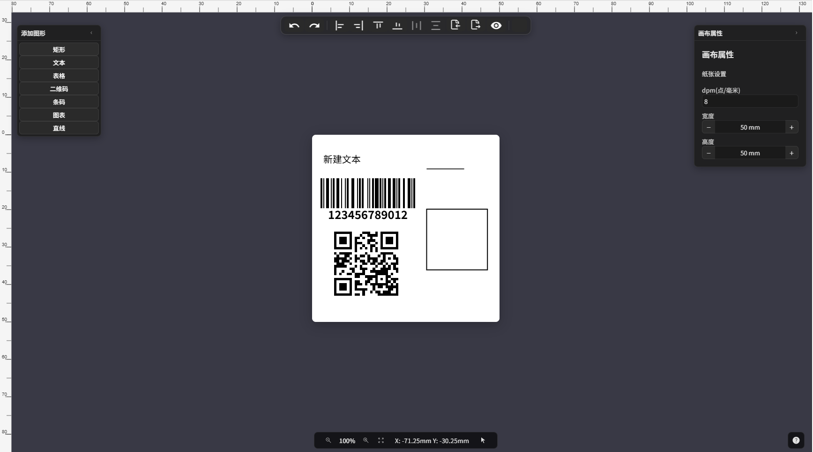

# vkedit

[](https://www.npmjs.com/package/vkedit)
[](LICENSE)
[](package.json)

A visual canvas designer component built on Vue 3 and Konva.js. Features a plugin-based architecture for label, QR code, barcode, receipt, business card, and certificate template design and print layout.

**[中文](README.md)**

---



---

## Features

- **Plugin-based architecture** - Core features and graphic elements are registered as plugins, enabled on demand
- **7 graphic element types** - Rectangle, text, line, table, QR code, barcode, chart (ECharts)
- **Undo / Redo** - Command pattern, all modifications are reversible
- **Import / Export** - JSON serialization, PNG/JPG images, PDF documents
- **Align & Distribute** - Left/right/top/bottom/center alignment, horizontal/vertical distribution
- **Ruler & Zoom** - Millimeter-precision ruler, configurable DPM (dots per millimeter)
- **Event-driven** - Type-safe event system for loosely coupled plugin communication
- **TypeScript** - Full type definitions with generic plugin and element type inference

---

## Installation

```bash
pnpm add vkedit vue konva vue-konva
```

vkedit declares `vue`, `konva`, and `vue-konva` as peerDependencies, which must be provided by the host project.

| Peer Dependency | Version  |
| --------------- | -------- |
| vue             | ^3.5.18  |
| konva           | ^10.0.2  |
| vue-konva       | ^3.2.6   |

Node.js requirement: `^20.19.0 || >=22.12.0`

---

## Quick Start

### 1. Configure entry file

Register VueKonva and import styles in `main.ts`:

```typescript
import { createApp } from 'vue'
import App from './App.vue'
import VueKonva from 'vue-konva'
import 'vkedit/dist/vkedit.css'

const app = createApp(App)
app.use(VueKonva)
app.mount('#app')
```

### 2. Use the editor component

```vue
<template>
  <Vkedit :host="host" />
</template>

<script setup lang="ts">
import { createEditorHost, Vkedit } from 'vkedit'
import {
  RectPlugin,
  TextPlugin,
  TablePlugin,
  QrcodePlugin,
  BarcodePlugin,
  ChartPlugin,
  LinePlugin,
} from 'vkedit'

const host = createEditorHost()

// Install graphic plugins
host
  .installPlugin('rect-plugin', RectPlugin)
  .installPlugin('text-plugin', TextPlugin)
  .installPlugin('table-plugin', TablePlugin)
  .installPlugin('qr-plugin', QrcodePlugin)
  .installPlugin('barcode-plugin', BarcodePlugin)
  .installPlugin('chart-plugin', ChartPlugin)
  .installPlugin('line-plugin', LinePlugin)

// Set canvas size (A4 paper, DPM = 8)
host.setStatus({
  dpm: 8,
  width: 210 * 8,
  height: 297 * 8,
  zoom: 0.4,
})
</script>
```

### Vkedit Component Props

| Prop                | Type         | Default | Description              |
| ------------------- | ------------ | ------- | ------------------------ |
| `host`              | `EditorHost` | -       | Editor host instance     |
| `showToolbox`       | `boolean`    | `true`  | Show left toolbox        |
| `showPropertyPanel` | `boolean`    | `true`  | Show right property panel|
| `showToolbar`       | `boolean`    | `true`  | Show top toolbar         |

---

## Configuration

### createEditorHost Options

`createEditorHost(options)` creates a host instance and automatically installs core plugins. Optional plugins are controlled by the following options:

| Option                   | Type      | Default | Description                |
| ------------------------ | --------- | ------- | -------------------------- |
| `basePropertyPanel`      | `boolean` | `false` | Base element property panel|
| `baseCanvasPropertyPanel`| `boolean` | `true`  | Canvas property panel      |
| `exportPlugin`           | `boolean` | `true`  | Export plugin              |
| `previewPlugin`          | `boolean` | `true`  | Preview plugin             |
| `importPlugin`           | `boolean` | `true`  | Import plugin              |

### Canvas State

Update canvas state via `host.setStatus()`, which supports partial updates:

```typescript
interface IEditorState {
  zoom: number         // Zoom level
  currentTool: string  // Current tool
  snapToGrid: boolean  // Snap to grid
  showGrid: boolean    // Show grid
  width: number        // Canvas width (pixels)
  height: number       // Canvas height (pixels)
  wmm: number          // Canvas width (millimeters)
  hmm: number          // Canvas height (millimeters)
  dpm: number          // Dots per millimeter (DPI / 25.4)
}
```

`width`/`height` and `wmm`/`hmm` are automatically converted via `dpm`. Setting `dpm` recalculates pixel dimensions from the current millimeter sizes.

---

## Plugin List

### Core Plugins (auto-installed by createEditorHost)

| Plugin | Description |
| --- | --- |
| `ToolbarManagerPlugin` | Top toolbar management |
| `GraphicToolManagerPlugin` | Graphic tool management |
| `GraphicManagerPlugin` | Graphic rendering management |
| `PropertyPanelManagerPlugin` | Dynamic property panel rendering |
| `ElementManagerPlugin` | Element lifecycle management |
| `SelectionPlugin` | Element selection and multi-select |
| `KeyDownPlugin` | Keyboard shortcuts |
| `SnapPlugin` | Grid snapping |
| `ClipboardPlugin` | Copy / cut / paste |
| `AlignPlugin` | Alignment and distribution |
| `ContextMenuManagerPlugin` | Context menu |

### Feature Plugins (enabled via options)

| Plugin | Option | Description |
| --- | --- | --- |
| `ExportPlugin` | `exportPlugin` | Export JSON / PNG / JPG / PDF |
| `ImportPlugin` | `importPlugin` | Import JSON files |
| `PreviewPlugin` | `previewPlugin` | Preview and print preview |

### Graphic Plugins (manually installed)

| Plugin | Element Type | Description |
| --- | --- | --- |
| `RectPlugin` | `rect` | Rectangle with fill and stroke |
| `TextPlugin` | `text` | Text with font, alignment, and style |
| `LinePlugin` | `line` | Line with color and width |
| `TablePlugin` | `table` | Table with rows, merged cells, and borders |
| `QrcodePlugin` | `qr` | QR code with foreground/background colors |
| `BarcodePlugin` | `barcode` | Barcode supporting CODE128, EAN-13, etc. |
| `ChartPlugin` | `chart` | Chart powered by ECharts |

---

## Core Concepts

### EditorHost

`EditorHost` is the core host class of the editor, managing plugins, state, commands, and history. After creating an instance via `createEditorHost()`, all operations revolve around the `host`.

### Plugin System

Plugins are managed via `installPlugin` / `uninstallPlugin` / `getPlugin`. Plugins must extend `BasePlugin` and implement the `onInstall()` hook. `getPlugin` supports generic type inference:

```typescript
const rectPlugin = host.getPlugin('rect-plugin') // inferred as RectPlugin
const exportPlugin = host.getPlugin('export-plugin')
```

### Command Pattern

All reversible operations are implemented as commands. `executeCommand()` executes a command and pushes it onto the history stack, while `undo()` / `redo()` navigate the stack:

```typescript
host.executeCommand(command)  // execute and push
host.undo()                    // undo
host.redo()                    // redo
```

### Event System

The editor provides type-safe event communication via `emit` / `on` / `off`:

```typescript
// Listen for element added
host.on('element:added', (payload) => {
  console.log('Element added:', payload.element)
})

// Listen for selection changed
host.on('selection:changed', (payload) => {
  console.log('Selected:', payload.selection)
})
```

For the full event list and custom event extension, refer to the API documentation.

---

## Common Operations

### Export / Import JSON

```typescript
// Export to JSON string
const json = host.toJSON()

// Load from JSON string
host.loadJSON(json)
```

Use ExportPlugin / ImportPlugin to trigger file download and file picker:

```typescript
const exportPlugin = host.getPlugin('export-plugin')
exportPlugin.handleExportJSON()   // download .json file
exportPlugin.handleExportImage()  // download PNG image
exportPlugin.handleExportPdf()    // download PDF document

const importPlugin = host.getPlugin('import-plugin')
importPlugin.handleImportJSON()   // open file picker
```

### Undo / Redo

```typescript
host.undo()
host.redo()
```

### Listen to Events

```typescript
host.on('selection:changed', (payload) => {
  console.log('Selected element IDs:', payload.selection)
})
```

### Add Element (via command)

```typescript
import { AddElementCommand } from 'vkedit'

const elementManager = host.getPlugin('element-manager-plugin')
const element = elementManager.createElement('rect')
host.executeCommand(new AddElementCommand(host, element))
```

### Update Element Property (via command)

```typescript
import { UpdatePropertyCommand } from 'vkedit'

host.executeCommand(
  new UpdatePropertyCommand(host, element, 'fill', 'red', 'blue')
)
```

### Batch Operations

```typescript
import { BatchCommand, UpdatePropertyCommand } from 'vkedit'

const batch = new BatchCommand(host, [
  new UpdatePropertyCommand(host, el1, 'fill', 'red', 'blue'),
  new UpdatePropertyCommand(host, el2, 'fill', 'red', 'green'),
])
host.executeCommand(batch)
```

---

## Use Cases

| Scenario | Applicable Plugins |
| --- | --- |
| Label template design | QR code, barcode, text, rectangle, table |
| QR code design | QR code, text, rectangle |
| Barcode design | Barcode, text, line |
| Receipt design | Table, text, rectangle, line |
| Business card design | Text, rectangle, line |
| Certificate design | Text, rectangle, table |
| Data visualization | Chart, text, rectangle |

---

## Available Commands

| Command | Constructor Params | Description |
| --- | --- | --- |
| `AddElementCommand` | `(host, element)` | Add element |
| `RemoveElementCommand` | `(host, element)` | Remove element |
| `TransformElementCommand` | `(host, element, oldState, newState)` | Transform element (position/size/rotation) |
| `UpdatePropertyCommand` | `(host, element, propertyPath, oldValue, newValue)` | Update property |
| `BatchCommand` | `(host, commands, description?)` | Batch command |
| `AlignElementsCommand` | `(host, alignment, elementIds)` | Align elements |
| `DistributeElementsCommand` | `(host, direction, elementIds)` | Distribute elements |
| `ChangeLayerOrderCommand` | `(host, elementId, direction)` | Change layer order |
| `ClearSelectionCommand` | `(host)` | Clear selection |

---

## Links

- [npm](https://www.npmjs.com/package/vkedit)
- [GitHub Releases](https://github.com/pwg-code/vkedit/releases)
- [Vue.js](https://vuejs.org/)
- [Konva.js](https://konvajs.org/)
- [vue-konva](https://www.npmjs.com/package/vue-konva)

---

## License

[MIT](LICENSE)

---

## Contact

- **QQ**: 16871824
- **Email**: 168715824@qq.com

Available for technical support, custom features, and project collaboration.

---

## Sponsor

If vkedit helps you, consider buying the author a coffee.

<div align="center">

<table>
  <tr>
    <td align="center">
      
      <br>Alipay
    </td>
    <td align="center">
      
      <br>WeChat
    </td>
  </tr>
</table>

</div>
