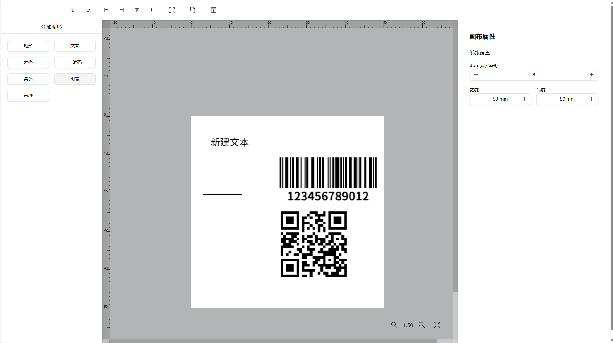
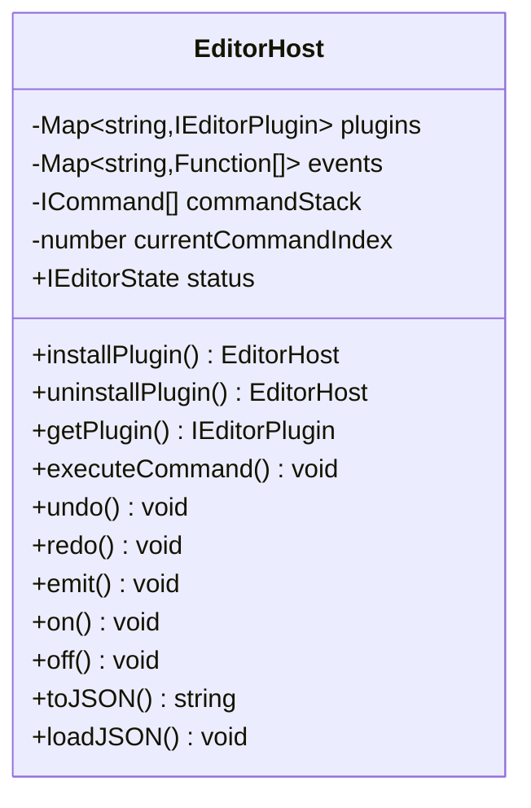
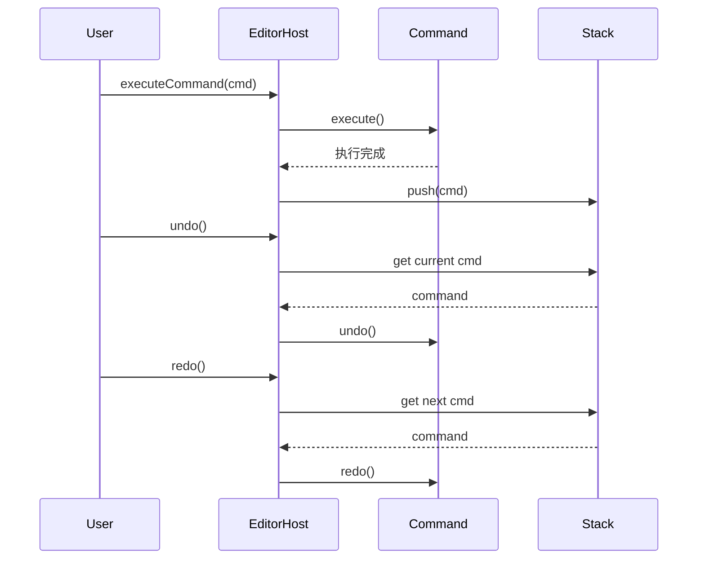
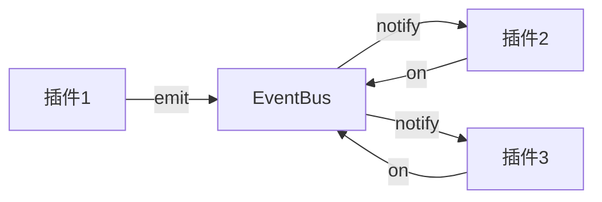
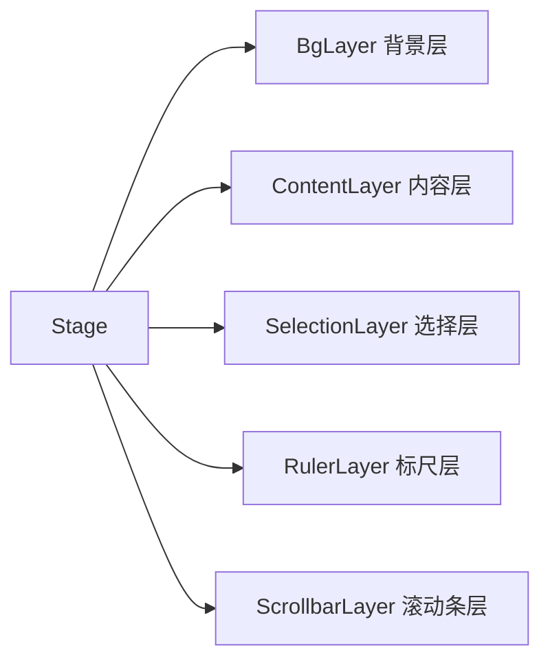

# vkedit

<div align="center">

[](https://www.npmjs.com/package/vkedit)
[](LICENSE)
[](package.json)

**Vue3 Konva Plug-in designer**

一个功能强大、可扩展的图形编辑器插件库，基于 Vue 3 和 Konva.js 构建。适用于标签模板设计、二维码设计、条码设计、票据设计、名片设计、证书设计等多种场景。

**[🇺🇸 English Version](README.en.md)**

</div>

<div align="center">



</div>

---

## 📖 项目简介

**vkedit** 是一个基于 Vue 3 和 Konva.js 的图形编辑器插件化设计库。它提供了一套完整的图形编辑功能，包括多种图形元素支持、插件系统架构、撤销/重做机制、导入/导出功能等。

该项目采用插件化架构设计，开发者可以根据需要灵活地启用或禁用各种功能模块，同时支持自定义插件和图形元素的扩展。

vkedit 特别适用于**标签模板设计**、**二维码设计**、**条码设计**、**票据设计**、**名片设计**、**证书设计**等多种图形设计场景，为开发者提供强大的可视化设计能力。

- **许可证**: MIT
- **Node.js 要求**: ^20.19.0 || >=22.12.0

---

## 🚀 安装与使用

### 环境要求

- **Node.js**: ^20.19.0 || >=22.12.0
- **包管理器**: pnpm 10.19.0+

### 安装

```bash
# 使用 npm
npm install vkedit vue konva vue-konva pinia

# 使用 pnpm
pnpm add vkedit vue konva vue-konva pinia

# 使用 yarn
yarn add vkedit vue konva vue-konva pinia
```

### 入口文件示例（main.ts）

在项目入口文件 `main.ts` 中，需要正确配置 Vue 应用、Pinia 状态管理和 VueKonva：

```typescript
import { createApp } from 'vue'
import { createPinia } from 'pinia'
import App from './App.vue'
import VueKonva from 'vue-konva'
import 'vkedit/dist/vkedit.css' // 导入 vkedit 样式

const app = createApp(App)

app.use(createPinia())
app.use(VueKonva)
app.mount('#app')
```

### 基础使用示例

```vue
<template>
  <Vkedit
    :host="host"
    :show-toolbox="true"
    :show-property-panel="true"
    :show-toolbar="true"
  />
</template>

<script setup lang="ts">
import { createEditorHost, Vkedit } from 'vkedit'
import { 
  RectPlugin, 
  TextPlugin, 
  TablePlugin,
  QrcodePlugin,
  BarcodePlugin,
  ChartPlugin,
  LinePlugin
} from 'vkedit'

// 创建编辑器宿主
const host = createEditorHost({ 
  basePropertyPanel: false,
  baseCanvasPropertyPanel: true,
  exportPlugin: true,
  previewPlugin: true,
  importPlugin: true
})

// 安装图形插件
host
  .installPlugin('rect-plugin', RectPlugin)
  .installPlugin('text-plugin', TextPlugin)
  .installPlugin('table-plugin', TablePlugin)
  .installPlugin('qr-plugin', QrcodePlugin)
  .installPlugin('barcode-plugin', BarcodePlugin)
  .installPlugin('chart-plugin', ChartPlugin)
  .installPlugin('line-plugin', LinePlugin)

// 设置画布尺寸（A4 纸张）
host.setStatus({
  dpm: 8,          // 每毫米点数 (DPI / 25.4)
  width: 210 * 8,  // A4 宽度 210mm
  height: 297 * 8, // A4 高度 297mm
  zoom: 0.4        // 缩放级别
})
</script>
```

### 可选配置说明

`createEditorHost` 函数接受以下配置选项：

| 选项                      | 类型    | 默认值 | 说明                     |
| ------------------------- | ------- | ------ | ------------------------ |
| `basePropertyPanel`       | boolean | false  | 是否启用基础元素属性面板 |
| `baseCanvasPropertyPanel` | boolean | true   | 是否启用画布属性面板     |
| `exportPlugin`            | boolean | true   | 是否启用导出插件         |
| `previewPlugin`           | boolean | true   | 是否启用预览插件         |
| `importPlugin`            | boolean | true   | 是否启用导入插件         |

---


## ✨ 核心特性

- **🔌 插件化架构**: 灵活的插件系统，可按需启用或禁用功能模块
- **🎨 多图形元素支持**:
  - 矩形 (Rectangle)
  - 文本 (Text)
  - 线条 (Line)
  - 表格 (Table)
  - 二维码 (QR Code)
  - 条形码 (Barcode)
  - 图表 (Chart)
- **📥📤 导入/导出功能**: 支持 JSON 格式的设计数据导入导出
- **↩️↪️ 撤销/重做机制**: 基于命令模式的完整历史记录管理
- **🏗️ 多图层画布系统**: 支持背景层、内容层、选择层、标尺层、滚动条层
- **🔍 缩放与标尺**: 精确的画布缩放和尺标显示
- **📐 对齐工具**: 支持元素的多种对齐和分布操作
- **📋 上下文菜单**: 右键菜单支持快捷操作
- **🎯 事件驱动**: 完善的事件系统支持插件间通信
- **🏷️ 丰富的应用场景**: 标签模板设计、二维码设计、条码设计、票据设计、名片设计、证书设计等

---

## 🎯 应用场景

vkedit 可广泛应用于以下场景：

| 应用场景         | 适用功能                         | 典型用途                                 |
| ---------------- | -------------------------------- | ---------------------------------------- |
| **标签模板设计** | 二维码、条形码、文本、矩形、表格 | 产品标签、物流标签、价格标签、库存标签   |
| **二维码设计**   | 二维码插件、文本、图形元素       | 营销二维码、支付二维码、信息二维码       |
| **条码设计**     | 条形码插件、文本、图形元素       | 商品条码、图书条码、库存条码、物流追踪码 |
| **票据设计**     | 表格、文本、矩形、线条           | 发票、收据、凭证、报表                   |
| **名片设计**     | 文本、矩形、图像元素             | 个人名片、公司名片、VIP 卡               |
| **证书设计**     | 文本、矩形、表格、图像元素       | 毕业证书、荣誉证书、资格证书             |
| **海报设计**     | 多种图形元素组合                 | 宣传海报、活动海报、产品海报             |
| **表单设计**     | 表格、文本、线条                 | 调查表、报名表、申请表                   |

### 典型使用案例

#### 1. 标签模板设计
```typescript
// 创建标签编辑器
const host = createEditorHost({
  exportPlugin: true,
  previewPlugin: true
})

// 安装标签设计所需插件
host
  .installPlugin('rect-plugin', RectPlugin)      // 边框、背景
  .installPlugin('text-plugin', TextPlugin)      // 文本信息
  .installPlugin('qr-plugin', QrcodePlugin)      // 产品二维码
  .installPlugin('barcode-plugin', BarcodePlugin)// 商品条形码
  .installPlugin('table-plugin', TablePlugin)    // 表格数据

// 设置标签尺寸（标准标签 100mm x 60mm）
host.setStatus({
  dpm: 8,
  width: 100 * 8,
  height: 60 * 8
})
```

#### 2. 二维码设计
```typescript
// 创建二维码设计器
const host = createEditorHost({
  exportPlugin: true
})

host
  .installPlugin('text-plugin', TextPlugin)      // 说明文字
  .installPlugin('qr-plugin', QrcodePlugin)      // 二维码元素
  .installPlugin('rect-plugin', RectPlugin)      // 装饰边框

// 设置画布尺寸
host.setStatus({
  dpm: 8,
  width: 150 * 8,
  height: 150 * 8
})
```

#### 3. 条码设计
```typescript
// 创建条码设计器
const host = createEditorHost({
  exportPlugin: true,
  previewPlugin: true
})

host
  .installPlugin('barcode-plugin', BarcodePlugin)// 条形码
  .installPlugin('text-plugin', TextPlugin)      // 商品信息
  .installPlugin('line-plugin', LinePlugin)      // 分割线

// 设置条码标签尺寸
host.setStatus({
  dpm: 8,
  width: 80 * 8,
  height: 50 * 8
})
```

---

## 🛠️ 技术栈

### 核心框架与库

| 依赖                                                 | 版本    | 说明                   |
| ---------------------------------------------------- | ------- | ---------------------- |
| [Vue](https://vuejs.org/)                            | ^3.5.18 | 渐进式 JavaScript 框架 |
| [Konva.js](https://konvajs.org/)                     | ^10.0.2 | 2D Canvas 库           |
| [vue-konva](https://www.npmjs.com/package/vue-konva) | ^3.2.6  | Vue 3 绑定             |
| [Pinia](https://pinia.vuejs.org/)                    | ^3.0.3  | Vue 状态管理           |
| [TypeScript](https://www.typescriptlang.org/)        | ~5.8.0  | 类型安全               |
| [Vite](https://vitejs.dev/)                          | ^7.0.6  | 构建工具               |

### 运行时依赖

- **@vueuse/core**: Vue 组合式工具库
- **echarts**: 图表库
- **exceljs**: Excel 文件处理
- **jsbarcode**: 条形码生成
- **jspdf**: PDF 导出
- **lodash**: JavaScript 实用工具库
- **qrcode**: 二维码生成
- **uuid**: 唯一标识符生成

### 开发工具

- ESLint & Prettier: 代码规范与格式化
- Tailwind CSS v4: 原子化 CSS 框架
- Reka UI: UI 组件库

---

## 🏗️ 架构设计

### 编辑器宿主机制

`EditorHost` 是整个编辑器的核心宿主类，负责管理所有插件、状态和事件。



### 插件系统架构

所有功能通过插件实现，插件可以注册到宿主并响应事件。

```mermaid
graph TD
    A[EditorHost] --> B[ToolbarManagerPlugin]
    A --> C[GraphicToolManagerPlugin]
    A --> D[ElementManagerPlugin]
    A --> E[SelectionPlugin]
    A --> F[PropertyPanelManagerPlugin]
    A --> G[ExportPlugin]
    A --> H[ImportPlugin]
    A --> I[PreviewPlugin]
    A --> J[KeyDownPlugin]
    A --> K[AlignPlugin]
    
    A --> L[RectPlugin]
    A --> M[TextPlugin]
    A --> N[TablePlugin]
    A --> O[QrcodePlugin]
    A --> P[BarcodePlugin]
    A --> Q[ChartPlugin]
    A --> R[LinePlugin]
```



### 命令模式（撤销/重做）

所有可撤销操作都通过命令实现，支持命令历史管理。



### 事件驱动机制

编辑器通过事件系统实现插件间的松耦合通信。



### 图层系统



---

## 📁 项目结构

```
vkedit/
├── src/
│   ├── commands/           # 命令模式实现
│   │   ├── base-command.ts
│   │   ├── add-element-command.ts
│   │   ├── remove-element-command.ts
│   │   ├── transform-element-command.ts
│   │   ├── update-property-command.ts
│   │   ├── batch-command.ts
│   │   ├── align-elements-command.ts
│   │   └── ...
│   ├── components/         # Vue 组件
│   │   ├── ui/            # UI 统一组件库
│   │   │   ├── button/
│   │   │   ├── dropdown-menu/
│   │   │   ├── input/
│   │   │   ├── select/
│   │   │   └── ...
│   │   ├── BaseElementPropertyPanel.vue
│   │   ├── CanvasPropertyPanel.vue
│   │   └── ...
│   ├── core/              # 核心编辑器组件
│   │   ├── Editor.vue
│   │   ├── editor-host.ts
│   │   ├── StageView.vue
│   │   ├── Toolbar.vue
│   │   ├── PropertyPanel.vue
│   │   ├── BgLayer.vue
│   │   ├── ContentLayer.vue
│   │   ├── SelectionLayer.vue
│   │   ├── RulerLayer.vue
│   │   ├── ScrollbarLayer.vue
│   │   ├── ContextMenu.vue
│   │   ├── Zoom.vue
│   │   └── Toolbox.vue
│   ├── hooks/             # Vue 组合式函数
│   │   ├── use-host-state.ts
│   │   ├── use-bg-layer.ts
│   │   ├── use-content-layer.ts
│   │   ├── use-selection-layer.ts
│   │   ├── use-ruler-layer.ts
│   │   ├── use-scrollbar-layer.ts
│   │   ├── use-zoom.ts
│   │   └── use-stage-event.ts
│   ├── plugins/           # 插件系统
│   │   ├── element-manager.ts
│   │   ├── graphic-tool-manager.ts
│   │   ├── graphic-manager.ts
│   │   ├── selection.ts
│   │   ├── toolbar-manager.ts
│   │   ├── keydown.ts
│   │   ├── align/
│   │   │   ├── Align.vue
│   │   │   └── align.ts
│   │   ├── export/
│   │   │   ├── Export.vue
│   │   │   └── export.ts
│   │   ├── import/
│   │   │   ├── Import.vue
│   │   │   └── import.ts
│   │   ├── preview/
│   │   │   ├── PreviewButton.vue
│   │   │   └── preview.ts
│   │   ├── rect/
│   │   │   ├── RectPlugin.ts
│   │   │   ├── Shape.vue
│   │   │   ├── PropertyPanel.vue
│   │   │   └── Tool.vue
│   │   ├── text/
│   │   ├── table/
│   │   ├── qrcode/
│   │   ├── barcode/
│   │   ├── chart/
│   │   ├── line/
│   │   └── context-menu-manager/
│   ├── stores/            # Pinia 状态管理
│   ├── types/             # TypeScript 类型定义
│   │   ├── base-graphic-element.ts
│   │   ├── base-graphic-type.ts
│   │   ├── base-plugin.ts
│   │   ├── event-map.ts
│   │   ├── event-data.ts
│   │   └── ...
│   ├── styles/            # 样式文件
│   ├── create-host.ts     # 宿主创建函数
│   └── index.ts           # 入口文件
├── playground/            # 示例项目
│   ├── App.vue
│   └── main.ts
├── package.json
├── vite.config.ts
├── tsconfig.json
└── README.md
```

---

## 🔌 可用插件列表

### 核心插件

| 插件名称                       | 说明                             |
| ------------------------------ | -------------------------------- |
| **ToolbarManagerPlugin**       | 工具栏管理器，提供顶部工具栏功能 |
| **GraphicToolManagerPlugin**   | 图形工具管理器，管理图形绘制工具 |
| **GraphicManagerPlugin**       | 图形管理器，统一管理所有图形元素 |
| **ElementManagerPlugin**       | 元素管理器，管理元素的生命周期   |
| **SelectionPlugin**            | 选择插件，处理元素选择和多选操作 |
| **PropertyPanelManagerPlugin** | 属性面板管理器，动态渲染属性面板 |
| **KeyDownPlugin**              | 键盘事件插件，处理快捷键         |
| **AlignPlugin**                | 对齐插件，提供元素对齐和分布功能 |
| **ContextMenuManagerPlugin**   | 上下文菜单管理器                 |

### 功能插件

| 插件名称          | 说明                                            |
| ----------------- | ----------------------------------------------- |
| **ExportPlugin**  | 导出插件，支持导出为 JSON、PNG、JPG、PDF 等格式 |
| **ImportPlugin**  | 导入插件，支持从 JSON 文件导入设计数据          |
| **PreviewPlugin** | 预览插件，提供设计预览功能                      |

### 图形插件

| 插件名称          | 图形类型 | 说明                                        |
| ----------------- | -------- | ------------------------------------------- |
| **RectPlugin**    | 矩形     | 可拖拽、缩放、调整填充和边框的矩形元素      |
| **TextPlugin**    | 文本     | 支持字体、大小、颜色、对齐方式的文本元素    |
| **LinePlugin**    | 线条     | 支持起点、终点、颜色、宽度的线条元素        |
| **TablePlugin**   | 表格     | 支持行列、边框、文字对齐的表格元素          |
| **QrcodePlugin**  | 二维码   | 可生成可配置的二维码元素                    |
| **BarcodePlugin** | 条形码   | 支持多种格式（EAN-13、CODE-128 等）的条形码 |
| **ChartPlugin**   | 图表     | 基于 ECharts 的图表元素                     |

---

## 📚 API 参考

### createEditorHost()

创建编辑器宿主实例并安装核心插件。

```typescript
function createEditorHost(options: IOptions): EditorHost
```

**参数:**

```typescript
interface IOptions {
  basePropertyPanel?: boolean      // 是否启用基础元素属性面板
  baseCanvasPropertyPanel?: boolean // 是否启用画布属性面板
  exportPlugin?: boolean           // 是否启用导出插件
  previewPlugin?: boolean          // 是否启用预览插件
  importPlugin?: boolean            // 是否启用导入插件
}
```

**返回:** `EditorHost` 实例

---

### EditorHost 类方法

#### 插件管理

| 方法                               | 说明         |
| ---------------------------------- | ------------ |
| `installPlugin(name, pluginClass)` | 安装插件     |
| `uninstallPlugin(pluginName)`      | 卸载插件     |
| `getPlugin<T>(pluginName)`         | 获取插件实例 |

```typescript
// 安装插件
host.installPlugin('rect-plugin', RectPlugin)

// 卸载插件
host.uninstallPlugin('rect-plugin')

// 获取插件实例
const rectPlugin = host.getPlugin<RectPlugin>('rect-plugin')
```

#### 命令操作

| 方法                      | 说明     |
| ------------------------- | -------- |
| `executeCommand(command)` | 执行命令 |
| `undo()`                  | 撤销     |
| `redo()`                  | 重做     |

```typescript
import { AddElementCommand } from 'vkedit'

// 执行命令
const command = new AddElementCommand(element, host)
host.executeCommand(command)

// 撤销
host.undo()

// 重做
host.redo()
```

#### 事件系统

| 方法                   | 说明     |
| ---------------------- | -------- |
| `emit(event, payload)` | 触发事件 |
| `on(event, handler)`   | 订阅事件 |
| `off(event, handler)`  | 取消订阅 |

```typescript
// 订阅事件
host.on('element:added', (payload) => {
  console.log('元素已添加:', payload)
})

// 触发事件
host.emit('element:added', { element: myElement })

// 取消订阅
host.off('element:added')
```

#### 状态管理

| 属性     | 类型           | 说明               |
| -------- | -------------- | ------------------ |
| `status` | `IEditorState` | 编辑器状态（只读） |

```typescript
interface IEditorState {
  zoom: number          // 缩放级别
  currentTool: string   // 当前工具
  snapToGrid: boolean   // 是否吸附网格
  showGrid: boolean     // 是否显示网格
  width: number         // 画布宽度（像素）
  height: number        // 画布高度（像素）
  wmm: number           // 画布宽度（毫米）
  hmm: number           // 画布高度（毫米）
  dpm: number           // 每毫米点数
}
```

```typescript
// 更新状态
host.setStatus({
  zoom: 1,
  width: 800,
  height: 600
})

// 读取状态
console.log(host.status.zoom)
```

#### 序列化

| 方法                | 说明               |
| ------------------- | ------------------ |
| `toJSON()`          | 导出为 JSON 字符串 |
| `loadJSON(jsonStr)` | 从 JSON 字符串导入 |

```typescript
// 导出
const json = host.toJSON()

// 导入
host.loadJSON(json)
```

---

## 🎯 事件系统

编辑器提供丰富的事件类型，支持插件间的松耦合通信。

### 生命周期事件

| 事件名           | 说明           |
| ---------------- | -------------- |
| `editor:ready`   | 编辑器准备就绪 |
| `editor:destroy` | 编辑器销毁     |
| `editor:reset`   | 编辑器重置     |

### 文件操作事件

| 事件名                 | 说明             |
| ---------------------- | ---------------- |
| `file:new`             | 新建文件         |
| `file:open`            | 打开文件         |
| `file:save`            | 保存文件         |
| `file:save-as`         | 另存为           |
| `file:export`          | 导出文件         |
| `file:import`          | 导入文件         |
| `file:loaded`          | 文件已加载       |
| `file:saved`           | 文件已保存       |
| `file:modified-change` | 文件修改状态变化 |

### 舞台交互事件

| 事件名              | 说明       |
| ------------------- | ---------- |
| `stage:mousedown`   | 鼠标按下   |
| `stage:mousemove`   | 鼠标移动   |
| `stage:mouseup`     | 鼠标松开   |
| `stage:click`       | 鼠标点击   |
| `stage:dblclick`    | 鼠标双击   |
| `stage:contextmenu` | 上下文菜单 |
| `stage:wheel`       | 鼠标滚轮   |
| `stage:dragstart`   | 拖拽开始   |
| `stage:dragend`     | 拖拽结束   |
| `stage:redraw`      | 舞台重绘   |

### 键盘事件

| 事件名                 | 说明     |
| ---------------------- | -------- |
| `stage:keydown`        | 键盘按下 |
| `stage:keydown-delete` | 删除键   |
| `stage:keydown-left`   | 左箭头   |
| `stage:keydown-right`  | 右箭头   |
| `stage:keydown-up`     | 上箭头   |
| `stage:keydown-down`   | 下箭头   |

### 图形元素事件

| 事件名                      | 说明         |
| --------------------------- | ------------ |
| `element:registered`        | 元素类型注册 |
| `element:unregistered`      | 元素类型注销 |
| `element:added`             | 元素添加     |
| `element:removed`           | 元素移除     |
| `element:selected`          | 元素选中     |
| `element:deselected`        | 元素取消选中 |
| `element:transformed`       | 元素变换     |
| `element:updated`           | 元素更新     |
| `element:copied`            | 元素复制     |
| `element:pasted`            | 元素粘贴     |
| `element:cloned`            | 元素克隆     |
| `element:locked-change`     | 锁定状态变化 |
| `element:visibility-change` | 可见性变化   |
| `element:zindex-change`     | 层级变化     |

### 选择事件

| 事件名                   | 说明     |
| ------------------------ | -------- |
| `selection:changed`      | 选择变化 |
| `selection:cleared`      | 清除选择 |
| `selection:multi-change` | 多选变化 |

### 视图事件

| 事件名                         | 说明       |
| ------------------------------ | ---------- |
| `view:zoom-change`             | 缩放变化   |
| `view:pan`                     | 平移       |
| `view:zoom-to`                 | 适应视图   |
| `view:reset`                   | 重置视图   |
| `view:grid-visibility-change`  | 网格可见性 |
| `view:snap-change`             | 吸附变化   |
| `view:ruler-visibility-change` | 标尺可见性 |

### 图层事件

| 事件名                    | 说明         |
| ------------------------- | ------------ |
| `layer:added`             | 图层添加     |
| `layer:removed`           | 图层移除     |
| `layer:order-changed`     | 图层顺序变化 |
| `layer:visibility-change` | 图层可见性   |
| `layer:locked-change`     | 图层锁定     |
| `layer:active-change`     | 图层激活     |

### 命令历史事件

| 事件名             | 说明     |
| ------------------ | -------- |
| `command:executed` | 命令执行 |
| `command:undone`   | 命令撤销 |
| `command:redone`   | 命令重做 |
| `history:changed`  | 历史变化 |
| `history:cleared`  | 历史清除 |

### 插件系统事件

| 事件名                | 说明     |
| --------------------- | -------- |
| `plugin:registered`   | 插件注册 |
| `plugin:unregistered` | 插件注销 |
| `plugin:activated`    | 插件激活 |
| `plugin:deactivated`  | 插件停用 |
| `plugin:loaded`       | 插件加载 |
| `plugin:error`        | 插件错误 |

### 对齐分布事件

| 事件名                | 说明         |
| --------------------- | ------------ |
| `elements:align`      | 元素对齐     |
| `elements:distribute` | 元素分布     |
| `elements:group`      | 元素组合     |
| `elements:ungroup`    | 元素取消组合 |
| `elements:layer`      | 图层操作     |

### 状态管理事件

| 事件名                 | 说明     |
| ---------------------- | -------- |
| `host:status-changed`  | 状态变化 |
| `host:status-saved`    | 状态保存 |
| `host:status-restored` | 状态恢复 |

### 序列化事件

| 事件名                    | 说明           |
| ------------------------- | -------------- |
| `host:load-json:start`    | 加载 JSON 开始 |
| `host:load-json:complete` | 加载 JSON 完成 |
| `host:load-json:error`    | 加载 JSON 错误 |
| `host:to-json:start`      | 导出 JSON 开始 |
| `host:to-json:complete`   | 导出 JSON 完成 |
| `host:to-json:error`      | 导出 JSON 错误 |

### 事件使用示例

```typescript
import type { ElementEventData, SelectionEventData } from 'vkedit'

// 监听元素添加事件
host.on('element:added', (payload: ElementEventData) => {
  console.log('新元素添加:', payload.element)
})

// 监听选择变化事件
host.on('selection:changed', (payload: SelectionEventData) => {
  console.log('选中元素数量:', payload.selectedIds.length)
})

// 监听状态变化
host.on('host:status-changed', (payload) => {
  console.log('状态已更新:', payload.status)
})

// 触发自定义事件
host.emit('custom:my-event', { data: 'some data' })
```

### 扩展事件系统

开发者可以通过模块声明扩展事件映射：

```typescript
declare module '@/types' {
  interface EventMap {
    'my-plugin:some-event': (payload: MyEventData) => void
  }
}

interface MyEventData {
  id: string
  value: number
}

// 使用扩展事件
host.emit('my-plugin:some-event', { id: '123', value: 42 })

// 监听扩展事件
host.on('my-plugin:some-event', (payload) => {
  console.log(payload.value)
})
```

---

## 📝 命令系统

vkedit 使用命令模式实现可撤销的操作。所有修改编辑器状态的操作都应通过命令执行。

### 可用命令类型

| 命令类                    | 说明                         |
| ------------------------- | ---------------------------- |
| `AddElementCommand`       | 添加元素                     |
| `RemoveElementCommand`    | 移除元素                     |
| `TransformElementCommand` | 变换元素（位置、大小、旋转） |
| `UpdatePropertyCommand`   | 更新元素属性                 |
| `ClearSelectionCommand`   | 清除选择                     |
| `BatchCommand`            | 批量命令                     |
| `ChangeLayerOrderCommand` | 改变图层顺序                 |
| `AlignElementsCommand`    | 对齐元素                     |

### 命令执行

```typescript
import { AddElementCommand, TransformElementCommand } from 'vkedit'

// 创建并执行命令
const command = new AddElementCommand(element, host)
host.executeCommand(command)
```

### 撤销和重做

```typescript
// 撤销上一步操作
host.undo()

// 重做已撤销的操作
host.redo()
```

### 批量命令

```typescript
import { BatchCommand } from 'vkedit'

const commands = [
  new UpdatePropertyCommand(element1, 'x', 100),
  new UpdatePropertyCommand(element2, 'y', 200)
]

const batchCommand = new BatchCommand(commands)
host.executeCommand(batchCommand)
```

---

## 💻 开发指南

### 开发环境设置

```bash
# 克隆仓库
git clone https://github.com/pwg-code/vkedit.git
cd vkedit

# 安装依赖（推荐使用 pnpm）
pnpm install

# 启动开发服务器
pnpm dev

# 类型检查
pnpm type-check

# 代码检查和修复
pnpm lint

# 代码格式化
pnpm format

# 构建生产版本
pnpm build
```

### 可用脚本命令

| 命令              | 说明                     |
| ----------------- | ------------------------ |
| `pnpm dev`        | 启动开发服务器           |
| `pnpm build`      | 构建生产版本             |
| `pnpm build-only` | 仅构建（不运行类型检查） |
| `pnpm preview`    | 预览生产构建             |
| `pnpm type-check` | TypeScript 类型检查      |
| `pnpm lint`       | ESLint 检查并自动修复    |
| `pnpm format`     | Prettier 格式化代码      |
| `pnpm build:css`  | 仅构建 CSS（等价于 build-only） |

### 开发自定义插件

自定义插件需要实现 [`IEditorPlugin`](src/types/base-plugin.ts:5) 接口：

```typescript
import type { IEditorPlugin } from 'vkedit'

export class MyCustomPlugin implements IEditorPlugin {
  constructor(private host: EditorHost) {}

  install(host: EditorHost): void {
    // 监听事件
    host.on('element:added', this.onElementAdded)
    
    // 注册工具
    host.emit('tool:registered', {
      name: 'my-tool',
      icon: 'my-icon',
      render: () => MyToolComponent
    })
  }

  uninstall(): void {
    // 清理资源
    this.host.off('element:added', this.onElementAdded)
  }

  private onElementAdded = (payload: any) => {
    console.log('元素已添加:', payload)
  }
}

// 使用自定义插件
host.installPlugin('my-custom-plugin', MyCustomPlugin)
```

### 自定义图形元素

创建自定义图形元素需要继承 [`BaseGraphicElement`](src/types/base-graphic-element.ts:5)：

```typescript
import { BaseGraphicElement } from 'vkedit'

export class MyCustomElement extends BaseGraphicElement {
  constructor(
    id: string,
    public width: number = 100,
    public height: number = 100,
    public fill: string = '#ff0000'
  ) {
    super(id, 'my-custom')
  }

  serialize(): Record<string, any> {
    return {
      ...super.serialize(),
      width: this.width,
      height: this.height,
      fill: this.fill
    }
  }

  deserialize(data: Record<string, any>): void {
    super.deserialize(data)
    this.width = data.width
    this.height = data.height
    this.fill = data.fill
  }

  render() {
    return {
      tag: 'rect',
      props: {
        x: this.x,
        y: this.y,
        width: this.width,
        height: this.height,
        fill: this.fill
      }
    }
  }
}
```

---

## ❓ 常见问题（FAQ）

### Q: 如何设置画布尺寸为 A4 纸张？

```typescript
host.setStatus({
  dpm: 8,          // 每毫米点数（DPI / 25.4）
  width: 210 * 8,  // A4 宽度 210mm
  height: 297 * 8  // A4 高度 297mm
})
```

### Q: 如何导出设计数据？

```typescript
// 导出为 JSON
const json = host.toJSON()

// 导出为图片（需要使用 ExportPlugin）
host.getPlugin('export-plugin').exportAsPNG()
```

### Q: 如何监听元素选择变化？

```typescript
host.on('selection:changed', (payload) => {
  const selectedIds = payload.selectedIds
  console.log('当前选中元素:', selectedIds)
})
```

### Q: 如何批量更新多个元素的属性？

```typescript
const batchCommand = new BatchCommand([
  new UpdatePropertyCommand(element1, 'fill', '#ff0000'),
  new UpdatePropertyCommand(element2, 'fill', '#00ff00'),
  new UpdatePropertyCommand(element3, 'fill', '#0000ff')
])
host.executeCommand(batchCommand)
```

### Q: 如何禁用所有核心插件并自定义配置？

```typescript
const host = createEditorHost({
  basePropertyPanel: false,
  baseCanvasPropertyPanel: false,
  exportPlugin: false,
  previewPlugin: false,
  importPlugin: false
})
```

---

## 🤝 贡献指南

欢迎贡献代码！请遵循以下规范：

### 代码规范

- 使用 TypeScript 编写代码
- 遵循 ESLint 规则（`pnpm lint` 自动检查）
- 使用 Prettier 格式化代码（`pnpm format`）
- 编写清晰的注释和文档

### 提交规范

使用语义化提交信息：

```
feat: 添加新功能
fix: 修复 bug
docs: 更新文档
style: 代码格式调整
refactor: 代码重构
perf: 性能优化
test: 添加测试
chore: 构建/工具变动
```

### 开发流程

1. Fork 仓库
2. 创建特性分支 (`git checkout -b feature/AmazingFeature`)
3. 提交更改 (`git commit -m 'feat: add amazing feature'`)
4. 推送到分支 (`git push origin feature/AmazingFeature`)
5. 创建 Pull Request

---

## 📋 更新日志

### 2.8.5
- 当前稳定版本
- 完整的插件系统架构
- 支持多种图形元素
- 导入/导出功能
- 撤销/重做机制

### 版本历史
详细版本历史请查看 [GitHub Releases](https://github.com/pwg-code/vkedit/releases)

---

## 📄 许可证

本项目采用 MIT 许可证 - 详见 [LICENSE](LICENSE) 文件

---

## 🔗 相关链接

- [Vue.js](https://vuejs.org/)
- [Konva.js](https://konvajs.org/)
- [vue-konva](https://www.npmjs.com/package/vue-konva)
- [Pinia](https://pinia.vuejs.org/)

---

## ☕ 支持作者

如果您觉得 vkedit 对您有帮助，欢迎支持作者喝杯咖啡！您的支持是项目持续发展的动力。

<div align="center">

**Made with ❤️ by vkedit contributors**

</div>

---

## 📞 联系支持

如果您需要技术支持、功能定制或有任何问题，欢迎随时联系：

- **QQ**: 16871824
- **邮箱**: 168715824@qq.com
- **服务**: 技术支持、功能定制、项目合作

期待与您交流，共同完善 vkedit！